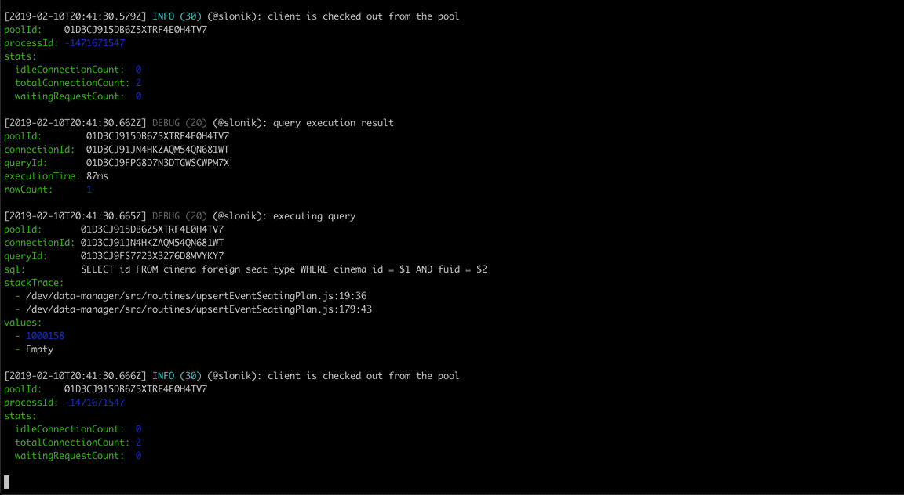
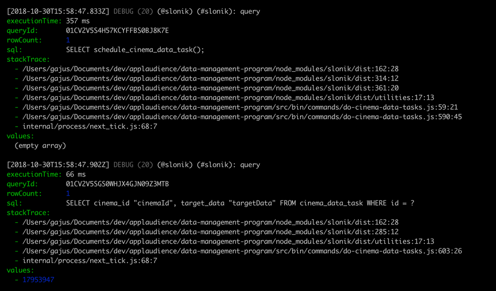
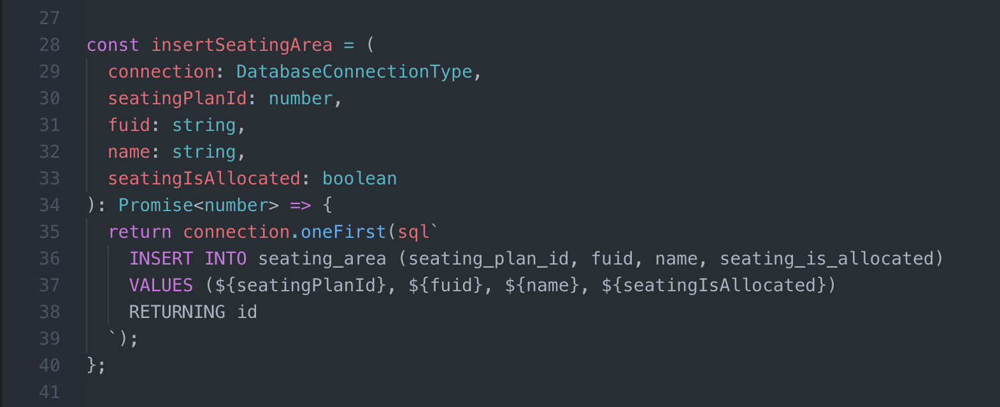
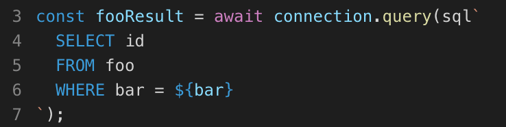

<a name="slonik"></a>
# Slonik

[](https://travis-ci.com/gajus/slonik)
[](https://coveralls.io/github/gajus/slonik)
[](https://www.npmjs.org/package/slonik)
[](https://github.com/gajus/canonical)
[](https://twitter.com/kuizinas)

A [battle-tested](#battle-tested) PostgreSQL client with strict types, detailed logging and assertions.



(The above GIF shows Slonik producing [query logs](https://github.com/gajus/slonik#logging). Slonik produces logs using [Roarr](https://github.com/gajus/roarr). Logs include stack trace of the actual query invocation location and values used to execute the query.)

<a name="slonik-sponsors"></a>
## Sponsors

If you value my work and want to see Slonik and [many other of my](https://github.com/gajus/) Open-Source projects to be continuously improved, then please consider becoming a patron:

[](https://www.buymeacoffee.com/gajus)
[](https://www.patreon.com/gajus)

<a name="slonik-principles"></a>
## Principles

* Promotes writing raw SQL.
* Discourages ad-hoc dynamic generation of SQL.

Read: [Stop using Knex.js](https://medium.com/@gajus/bf410349856c)

Note: Using this project does not require TypeScript. It is a regular ES6 module. Ignore the type definitions used in the documentation if you do not use a type system.

<a name="slonik-features"></a>
## Features

* [Assertions and type safety](#repeating-code-patterns-and-type-safety).
* [Connection mocking](#mocking-slonik).
* [Safe connection handling](#protecting-against-unsafe-connection-handling).
* [Safe transaction handling](#protecting-against-unsafe-transaction-handling).
* [Safe value interpolation](#protecting-against-unsafe-value-interpolation).
* [Transaction nesting](#transaction-nesting).
* [Transaction retrying](#transaction-retrying)
* Detailed [logging](#slonik-debugging).
* [Asynchronous stack trace resolution](#capture-stack-trace).
* [Middlewares](#slonik-interceptors).
* [Mapped errors](#error-handling).
* [ESLint plugin](https://github.com/gajus/eslint-plugin-sql).

<a name="slonik-contents"></a>
## Contents

* [Slonik](#slonik)
    * [Sponsors](#slonik-sponsors)
    * [Principles](#slonik-principles)
    * [Features](#slonik-features)
    * [Contents](#slonik-contents)
    * [About Slonik](#slonik-about-slonik)
        * [Battle-Tested](#slonik-about-slonik-battle-tested)
        * [Origin of the name](#slonik-about-slonik-origin-of-the-name)
        * [Repeating code patterns and type safety](#slonik-about-slonik-repeating-code-patterns-and-type-safety)
        * [Protecting against unsafe connection handling](#slonik-about-slonik-protecting-against-unsafe-connection-handling)
        * [Protecting against unsafe transaction handling](#slonik-about-slonik-protecting-against-unsafe-transaction-handling)
        * [Protecting against unsafe value interpolation](#slonik-about-slonik-protecting-against-unsafe-value-interpolation)
    * [Documentation](#slonik-documentation)
    * [Usage](#slonik-usage)
        * [Create connection](#slonik-usage-create-connection)
        * [End connection pool](#slonik-usage-end-connection-pool)
        * [Describing the current state of the connection pool](#slonik-usage-describing-the-current-state-of-the-connection-pool)
        * [API](#slonik-usage-api)
        * [Default configuration](#slonik-usage-default-configuration)
        * [Using native libpq bindings](#slonik-usage-using-native-libpq-bindings)
        * [Checking out a client from the connection pool](#slonik-usage-checking-out-a-client-from-the-connection-pool)
        * [Mocking Slonik](#slonik-usage-mocking-slonik)
    * [How are they different?](#slonik-how-are-they-different)
        * [`pg` vs `slonik`](#slonik-how-are-they-different-pg-vs-slonik)
        * [`pg-promise` vs `slonik`](#slonik-how-are-they-different-pg-promise-vs-slonik)
    * [Type parsers](#slonik-type-parsers)
        * [Built-in type parsers](#slonik-type-parsers-built-in-type-parsers)
    * [Interceptors](#slonik-interceptors)
        * [Interceptor methods](#slonik-interceptors-interceptor-methods)
        * [Community interceptors](#slonik-interceptors-community-interceptors)
    * [Recipes](#slonik-recipes)
        * [Inserting large number of rows](#slonik-recipes-inserting-large-number-of-rows)
        * [Routing queries to different connections](#slonik-recipes-routing-queries-to-different-connections)
    * [`sql` tag](#slonik-sql-tag)
    * [Value placeholders](#slonik-value-placeholders)
        * [Tagged template literals](#slonik-value-placeholders-tagged-template-literals)
        * [Manually constructing the query](#slonik-value-placeholders-manually-constructing-the-query)
        * [Nesting `sql`](#slonik-value-placeholders-nesting-sql)
    * [Query building](#slonik-query-building)
        * [`sql.array`](#slonik-query-building-sql-array)
        * [`sql.binary`](#slonik-query-building-sql-binary)
        * [`sql.identifier`](#slonik-query-building-sql-identifier)
        * [`sql.json`](#slonik-query-building-sql-json)
        * [`sql.join`](#slonik-query-building-sql-join)
        * [`sql.unnest`](#slonik-query-building-sql-unnest)
    * [Query methods](#slonik-query-methods)
        * [`any`](#slonik-query-methods-any)
        * [`anyFirst`](#slonik-query-methods-anyfirst)
        * [`exists`](#slonik-query-methods-exists)
        * [`copyFromBinary`](#slonik-query-methods-copyfrombinary)
        * [`many`](#slonik-query-methods-many)
        * [`manyFirst`](#slonik-query-methods-manyfirst)
        * [`maybeOne`](#slonik-query-methods-maybeone)
        * [`maybeOneFirst`](#slonik-query-methods-maybeonefirst)
        * [`one`](#slonik-query-methods-one)
        * [`oneFirst`](#slonik-query-methods-onefirst)
        * [`query`](#slonik-query-methods-query)
        * [`stream`](#slonik-query-methods-stream)
        * [`transaction`](#slonik-query-methods-transaction)
    * [Error handling](#slonik-error-handling)
        * [Original `node-postgres` error](#slonik-error-handling-original-node-postgres-error)
        * [Handling `BackendTerminatedError`](#slonik-error-handling-handling-backendterminatederror)
        * [Handling `CheckIntegrityConstraintViolationError`](#slonik-error-handling-handling-checkintegrityconstraintviolationerror)
        * [Handling `ConnectionError`](#slonik-error-handling-handling-connectionerror)
        * [Handling `DataIntegrityError`](#slonik-error-handling-handling-dataintegrityerror)
        * [Handling `ForeignKeyIntegrityConstraintViolationError`](#slonik-error-handling-handling-foreignkeyintegrityconstraintviolationerror)
        * [Handling `NotFoundError`](#slonik-error-handling-handling-notfounderror)
        * [Handling `NotNullIntegrityConstraintViolationError`](#slonik-error-handling-handling-notnullintegrityconstraintviolationerror)
        * [Handling `StatementCancelledError`](#slonik-error-handling-handling-statementcancellederror)
        * [Handling `StatementTimeoutError`](#slonik-error-handling-handling-statementtimeouterror)
        * [Handling `UniqueIntegrityConstraintViolationError`](#slonik-error-handling-handling-uniqueintegrityconstraintviolationerror)
        * [Handling `TupleMovedToAnotherPartitionError`](#slonik-error-handling-handling-tuplemovedtoanotherpartitionerror)
    * [Types](#slonik-types)
    * [Debugging](#slonik-debugging)
        * [Logging](#slonik-debugging-logging)
        * [Capture stack trace](#slonik-debugging-capture-stack-trace)
    * [Syntax Highlighting](#slonik-syntax-highlighting)
        * [Atom Syntax Highlighting Plugin](#slonik-syntax-highlighting-atom-syntax-highlighting-plugin)
        * [VS Code Syntax Highlighting Extension](#slonik-syntax-highlighting-vs-code-syntax-highlighting-extension)


<a name="slonik-about-slonik"></a>
## About Slonik

<a name="slonik-about-slonik-battle-tested"></a>
### Battle-Tested

Slonik began as a collection of utilities designed for working with [`node-postgres`](https://github.com/brianc/node-postgres). We continue to use `node-postgres` as it provides a robust foundation for interacting with PostgreSQL. However, what once was a collection of utilities has since grown into a framework that abstracts repeating code patterns, protects against unsafe connection handling and value interpolation, and provides rich debugging experience.

Slonik has been [battle-tested](https://medium.com/@gajus/lessons-learned-scaling-postgresql-database-to-1-2bn-records-month-edc5449b3067) with large data volumes and queries ranging from simple CRUD operations to data-warehousing needs.

<a name="slonik-about-slonik-origin-of-the-name"></a>
### Origin of the name


The name of the elephant depicted in the official PostgreSQL logo is Slonik. The name itself is derived from the Russian word for "little elephant".

Read: [The History of Slonik, the PostgreSQL Elephant Logo](https://www.vertabelo.com/blog/notes-from-the-lab/the-history-of-slonik-the-postgresql-elephant-logo)

<a name="slonik-about-slonik-repeating-code-patterns-and-type-safety"></a>
### Repeating code patterns and type safety

Among the primary reasons for developing Slonik, was the motivation to reduce the repeating code patterns and add a level of type safety. This is primarily achieved through the methods such as `one`, `many`, etc. But what is the issue? It is best illustrated with an example.

Suppose the requirement is to write a method that retrieves a resource ID given values defining (what we assume to be) a unique constraint. If we did not have the aforementioned convenience methods available, then it would need to be written as:

```js
import {
  sql
} from 'slonik';
import type {
  DatabaseConnectionType
} from 'slonik';

type DatabaseRecordIdType = number;

const getFooIdByBar = async (connection: DatabaseConnectionType, bar: string): Promise<DatabaseRecordIdType> => {
  const fooResult = await connection.query(sql`
    SELECT id
    FROM foo
    WHERE bar = ${bar}
  `);

  if (fooResult.rowCount === 0) {
    throw new Error('Resource not found.');
  }

  if (fooResult.rowCount > 1) {
    throw new Error('Data integrity constraint violation.');
  }

  return fooResult[0].id;
};

```

`oneFirst` method abstracts all of the above logic into:

```js
const getFooIdByBar = (connection: DatabaseConnectionType, bar: string): Promise<DatabaseRecordIdType> => {
  return connection.oneFirst(sql`
    SELECT id
    FROM foo
    WHERE bar = ${bar}
  `);
};

```

`oneFirst` throws:

* `NotFoundError` if query returns no rows
* `DataIntegrityError` if query returns multiple rows
* `DataIntegrityError` if query returns multiple columns

This becomes particularly important when writing routines where multiple queries depend on the previous result. Using methods with inbuilt assertions ensures that in case of an error, the error points to the original source of the problem. In contrast, unless assertions for all possible outcomes are typed out as in the previous example, the unexpected result of the query will be fed to the next operation. If you are lucky, the next operation will simply break; if you are unlucky, you are risking data corruption and hard to locate bugs.

Furthermore, using methods that guarantee the shape of the results, allows us to leverage static type checking and catch some of the errors even before they executing the code, e.g.

```js
const fooId = await connection.many(sql`
  SELECT id
  FROM foo
  WHERE bar = ${bar}
`);

await connection.query(sql`
  DELETE FROM baz
  WHERE foo_id = ${fooId}
`);

```

Static type check of the above example will produce a warning as the `fooId` is guaranteed to be an array and binding of the last query is expecting a primitive value.

<a name="slonik-about-slonik-protecting-against-unsafe-connection-handling"></a>
### Protecting against unsafe connection handling

Slonik only allows to check out a connection for the duration of the promise routine supplied to the `pool#connect()` method.

The primary reason for implementing _only_ this connection pooling method is because the alternative is inherently unsafe, e.g.

```js
// Note: This example is using unsupported API.

const main = async () => {
  const connection = await pool.connect();

  await connection.query(sql`SELECT foo()`);

  await connection.release();
};

```

In this example, if `SELECT foo()` produces an error, then connection is never released, i.e. the connection remains to hang.

A fix to the above is to ensure that `connection#release()` is always called, i.e.

```js
// Note: This example is using unsupported API.

const main = async () => {
  const connection = await pool.connect();

  let lastExecutionResult;

  try {
    lastExecutionResult = await connection.query(sql`SELECT foo()`);
  } finally {
    await connection.release();
  }

  return lastExecutionResult;
};

```

Slonik abstracts the latter pattern into `pool#connect()` method.

```js
const main = () => {
  return pool.connect((connection) => {
    return connection.query(sql`SELECT foo()`);
  });
};

```

Connection is always released back to the pool after the promise produced by the function supplied to `connect()` method is either resolved or rejected.

<a name="slonik-about-slonik-protecting-against-unsafe-transaction-handling"></a>
### Protecting against unsafe transaction handling

Just like in the [unsafe connection handling](#protecting-against-unsafe-connection-handling) described above, Slonik only allows to create a transaction for the duration of the promise routine supplied to the `connection#transaction()` method.

```js
connection.transaction(async (transactionConnection) => {
  await transactionConnection.query(sql`INSERT INTO foo (bar) VALUES ('baz')`);
  await transactionConnection.query(sql`INSERT INTO qux (quux) VALUES ('quuz')`);
});

```

This pattern ensures that the transaction is either committed or aborted the moment the promise is either resolved or rejected.

<a name="slonik-about-slonik-protecting-against-unsafe-value-interpolation"></a>
### Protecting against unsafe value interpolation

[SQL injections](https://en.wikipedia.org/wiki/SQL_injection) are one of the most well known attack vectors. Some of the [biggest data leaks](https://en.wikipedia.org/wiki/SQL_injection#Examples) were the consequence of improper user-input handling. In general, SQL injections are easily preventable by using parameterization and by restricting database permissions, e.g.

```js
// Note: This example is using unsupported API.

connection.query('SELECT $1', [
  userInput
]);

```

In this example, the query text (`SELECT $1`) and parameters (value of the `userInput`) are passed to the PostgreSQL server where the parameters are safely substituted into the query. This is a safe way to execute a query using user-input.

The vulnerabilities appear when developers cut corners or when they do not know about parameterization, i.e. there is a risk that someone will instead write:

```js
// Note: This example is using unsupported API.

connection.query('SELECT \'' + userInput + '\'');

```

As evident by the history of the data leaks, this happens more often than anyone would like to admit. This is especially a big risk in Node.js community, where predominant number of developers are coming from frontend and have not had training working with RDBMSes. Therefore, one of the key selling points of Slonik is that it adds multiple layers of protection to prevent unsafe handling of user-input.

To begin with, Slonik does not allow to run plain-text queries.

```js
connection.query('SELECT 1');

```

The above invocation would produce an error:

> TypeError: Query must be constructed using `sql` tagged template literal.

This means that the only way to run a query is by constructing it using [`sql` tagged template literal](https://github.com/gajus/slonik#slonik-value-placeholders-tagged-template-literals), e.g.

```js
connection.query(sql`SELECT 1`);

```

To add a parameter to the query, user must use [template literal placeholders](https://developer.mozilla.org/en-US/docs/Web/JavaScript/Reference/Template_literals#Description), e.g.

```js
connection.query(sql`SELECT ${userInput}`);

```

Slonik takes over from here and constructs a query with value bindings, and sends the resulting query text and parameters to the PostgreSQL. As `sql` tagged template literal is the only way to execute the query, it adds a strong layer of protection against accidental unsafe user-input handling due to limited knowledge of the SQL client API.

As Slonik restricts user's ability to generate and execute dynamic SQL, it provides helper functions used to generate fragments of the query and the corresponding value bindings, e.g. [`sql.identifier`](#sqlidentifier), [`sql.join`](#sqljoin) and [`sql.unnest`](#sqlunnest). These methods generate tokens that the query executor interprets to construct a safe query, e.g.

```js
connection.query(sql`
  SELECT ${sql.identifier(['foo', 'a'])}
  FROM (
    VALUES
    (
      ${sql.join(
        [
          sql.join(['a1', 'b1', 'c1'], sql`, `),
          sql.join(['a2', 'b2', 'c2'], sql`, `)
        ],
        sql`), (`
      )}
    )
  ) foo(a, b, c)
  WHERE foo.b IN (${sql.join(['c1', 'a2'], sql`, `)})
`);

```

This (contrived) example generates a query equivalent to:

```sql
SELECT "foo"."a"
FROM (
  VALUES
    ($1, $2, $3),
    ($4, $5, $6)
) foo(a, b, c)
WHERE foo.b IN ($7, $8)

```

That is executed with the parameters provided by the user.

To sum up, Slonik is designed to prevent accidental creation of queries vulnerable to SQL injections.


<a name="slonik-documentation"></a>
## Documentation

<a name="slonik-usage"></a>
## Usage

<a name="slonik-usage-create-connection"></a>
### Create connection

Use `createPool` to create a connection pool, e.g.

```js
import {
  createPool,
} from 'slonik';

const pool = createPool('postgres://');

```

Instance of Slonik connection pool can be then used to create a new connection, e.g.

```js
pool.connect(async (connection) => {
  await connection.query(sql`SELECT 1`);
});

```

The connection will be kept alive until the promise resolves (the result of the method supplied to `connect()`).

Refer to [query method](#slonik-query-methods) documentation to learn about the connection methods.

If you do not require having a persistent connection to the same backend, then you can directly use `pool` to run queries, e.g.

```js
pool.query(sql`SELECT 1`);

```

Beware that in the latter example, the connection picked to execute the query is a random connection from the connection pool, i.e. using the latter method (without explicit `connect()`) does not guarantee that multiple queries will refer to the same backend.

<a name="slonik-usage-end-connection-pool"></a>
### End connection pool

Use `pool.end()` to end idle connections and prevent creation of new connections.

The result of `pool.end()` is a promise that is resolved when all connections are ended.

```js
import {
  createPool,
  sql,
} from 'slonik';

const pool = createPool('postgres://');

const main = async () => {
  await pool.query(sql`
    SELECT 1
  `);

  await pool.end();
};

main();

```

Note: `pool.end()` does not terminate active connections/ transactions.

<a name="slonik-usage-describing-the-current-state-of-the-connection-pool"></a>
### Describing the current state of the connection pool

Use `pool.getPoolState()` to find out if pool is alive and how many connections are active and idle, and how many clients are waiting for a connection.

```js
import {
  createPool,
  sql,
} from 'slonik';

const pool = createPool('postgres://');

const main = async () => {
  pool.getPoolState();

  // {
  //   activeConnectionCount: 0,
  //   ended: false,
  //   idleConnectionCount: 0,
  //   waitingClientCount: 0,
  // }

  await pool.connect(() => {
    pool.getPoolState();

    // {
    //   activeConnectionCount: 1,
    //   ended: false,
    //   idleConnectionCount: 0,
    //   waitingClientCount: 0,
    // }
  });

  pool.getPoolState();

  // {
  //   activeConnectionCount: 0,
  //   ended: false,
  //   idleConnectionCount: 1,
  //   waitingClientCount: 0,
  // }

  await pool.end();

  pool.getPoolState();

  // {
  //   activeConnectionCount: 0,
  //   ended: true,
  //   idleConnectionCount: 0,
  //   waitingClientCount: 0,
  // }
};

main();

```

Note: `pool.end()` does not terminate active connections/ transactions.

<a name="slonik-usage-api"></a>
### API

```js
/**
 * @param connectionUri PostgreSQL [Connection URI](https://www.postgresql.org/docs/current/libpq-connect.html#LIBPQ-CONNSTRING).
 */
createPool(
  connectionUri: string,
  clientConfiguration: ClientConfigurationType
): DatabasePoolType;

/**
 * @property captureStackTrace Dictates whether to capture stack trace before executing query. Middlewares access stack trace through query execution context. (Default: true)
 * @property connectionRetryLimit Number of times to retry establishing a new connection. (Default: 3)
 * @property connectionTimeout Timeout (in milliseconds) after which an error is raised if connection cannot cannot be established. (Default: 5000)
 * @property idleInTransactionSessionTimeout Timeout (in milliseconds) after which idle clients are closed. Use 'DISABLE_TIMEOUT' constant to disable the timeout. (Default: 60000)
 * @property idleTimeout Timeout (in milliseconds) after which idle clients are closed. Use 'DISABLE_TIMEOUT' constant to disable the timeout. (Default: 5000)
 * @property interceptors An array of [Slonik interceptors](https://github.com/gajus/slonik#slonik-interceptors).
 * @property maximumPoolSize Do not allow more than this many connections. Use 'DISABLE_TIMEOUT' constant to disable the timeout. (Default: 10)
 * @property pgClient Override the underlying PostgreSQL client.
 * @property statementTimeout Timeout (in milliseconds) after which database is instructed to abort the query. Use 'DISABLE_TIMEOUT' constant to disable the timeout. (Default: 60000)
 * @property transactionRetryLimit Number of times a transaction failing with Transaction Rollback class error is retried. (Default: 5)
 * @property typeParsers An array of [Slonik type parsers](https://github.com/gajus/slonik#slonik-type-parsers).
 */
type ClientConfigurationInputType = {
  captureStackTrace?: boolean,
  connectionRetryLimit?: number,
  connectionTimeout?: number | 'DISABLE_TIMEOUT',
  idleInTransactionSessionTimeout?: number | 'DISABLE_TIMEOUT',
  idleTimeout?: number | 'DISABLE_TIMEOUT',
  interceptors?: InterceptorType[],
  maximumPoolSize?: number,
  pgClient?: PgClientType,
  statementTimeout?: number | 'DISABLE_TIMEOUT',
  transactionRetryLimit?: number,
  typeParsers?: TypeParserType[],
};

```

Example:

```js
import {
  createPool
} from 'slonik';

const pool = createPool('postgres://');

await pool.query(sql`SELECT 1`);

```

<a name="slonik-usage-default-configuration"></a>
### Default configuration

<a name="slonik-usage-default-configuration-default-interceptors"></a>
#### Default interceptors

None.

Check out [`slonik-interceptor-preset`](https://github.com/gajus/slonik-interceptor-preset) for an opinionated collection of interceptors.

<a name="slonik-usage-default-configuration-default-type-parsers"></a>
#### Default type parsers

These type parsers are enabled by default:

|Type name|Implementation|
|---|---|
|`date`|Produces a literal date as a string (format: YYYY-MM-DD).|
|`int8`|Produces an integer.|
|`interval`|Produces interval in seconds (integer).|
|`numeric`|Produces a float.|
|`timestamp`|Produces a unix timestamp (in milliseconds).|
|`timestamptz`|Produces a unix timestamp (in milliseconds).|

To disable the default type parsers, pass an empty array, e.g.

```js
createPool('postgres://', {
  typeParsers: []
});

```

You can create default type parser collection using `createTypeParserPreset`, e.g.

```js
import {
  createTypeParserPreset
} from 'slonik';

createPool('postgres://', {
  typeParsers: [
    ...createTypeParserPreset()
  ]
});

```

<a name="slonik-usage-default-configuration-default-timeouts"></a>
#### Default timeouts

There are 4 types of configurable timeouts:

|Configuration|Description|Default|
|---|---|---|
|`connectionTimeout`|Timeout (in milliseconds) after which an error is raised if connection cannot cannot be established.|5000|
|`idleInTransactionSessionTimeout`|Timeout (in milliseconds) after which idle clients are closed. Use 'DISABLE_TIMEOUT' constant to disable the timeout.|60000|
|`idleTimeout`|Timeout (in milliseconds) after which idle clients are closed. Use 'DISABLE_TIMEOUT' constant to disable the timeout.|5000|
|`statementTimeout`|Timeout (in milliseconds) after which database is instructed to abort the query. Use 'DISABLE_TIMEOUT' constant to disable the timeout.|60000|

Slonik sets aggressive timeouts by default. These timeouts are designed to provide safe interface to the database. These timeouts might not work for all programs. If your program has long running statements, consider adjusting timeouts just for those statements instead of changing the defaults.

<a name="slonik-usage-using-native-libpq-bindings"></a>
### Using native libpq bindings

In order to use native [libpq](https://www.npmjs.com/package/libpq) PostgreSQL bindings install `pg-native` and configure `pgClient`, e.g.

```js
// You have to have pg-native installed for this to work.
// `native` is intentionally imported from 'pg' and not 'pg-native'.
import {
  native as pgClient,
} from 'pg';
import {
  createPool,
} from 'slonik';

const pool = createPool('postgres://', {
  pgClient,
});

```

<a name="slonik-usage-using-native-libpq-bindings-known-limitations-of-using-pg-native-with-slonik"></a>
#### Known limitations of using pg-native with Slonik

* notice logs are not captured in `notices` query result property (`notice` event is never fired on connection instance).
* cannot combine multiple commands into a single statement (pg-native limitation [#88](https://github.com/brianc/node-pg-native/issues/88))
* does not support streams.

<a name="slonik-usage-checking-out-a-client-from-the-connection-pool"></a>
### Checking out a client from the connection pool

Slonik only allows to check out a connection for the duration of the promise routine supplied to the `pool#connect()` method.

```js
import {
  createPool,
} from 'slonik';

const pool = createPool('postgres://localhost');

const result = await pool.connect(async (connection) => {
  await connection.query(sql`SELECT 1`);
  await connection.query(sql`SELECT 2`);

  return 'foo';
});

result;
// 'foo'

```

Connection is released back to the pool after the promise produced by the function supplied to `connect()` method is either resolved or rejected.

Read: [Protecting against unsafe connection handling](#protecting-against-unsafe-connection-handling)

<a name="slonik-usage-mocking-slonik"></a>
### Mocking Slonik

Slonik provides a way to mock queries against the database.

* Use `createMockPool` to create a mock connection.
* Use `createMockQueryResult` to create a mock query result.

```js
import {
  createMockPool,
  createMockQueryResult,
} from 'slonik';

type OverridesType =
  query: (sql: string, values: PrimitiveValueExpressionType[],) => Promise<QueryResultType<QueryResultRowType>>,
};

createMockPool(overrides: OverridesType): DatabasePoolType;
createMockQueryResult(rows: QueryResultRowType[]): QueryResultType<QueryResultRowType>;

```

Example:

```js
import {
  createMockPool,
  createMockQueryResult,
} from 'slonik';

const pool = createMockPool({
  query: async () => {
    return createMockQueryResult([
      {
        foo: 'bar',
      },
    ]);
  },
});

await pool.connect(async (connection) => {
  const results = await connection.query(sql`
    SELECT ${'foo'}
  `);
});

```

<a name="slonik-how-are-they-different"></a>
## How are they different?

<a name="slonik-how-are-they-different-pg-vs-slonik"></a>
### <code>pg</code> vs <code>slonik</code>

[`pg`](https://github.com/brianc/node-postgres) is built intentionally to provide unopinionated, minimal abstraction and encourages use of other modules to implement convenience methods.

Slonik is built on top of `pg` and it provides convenience methods for [building queries](#value-placeholders) and [querying data](#slonik-query-methods).

Work on `pg` began on [Tue Sep 28 22:09:21 2010](https://github.com/brianc/node-postgres/commit/cf637b08b79ef93d9a8b9dd2d25858aa7e9f9bdc). It is authored by [Brian Carlson](https://github.com/brianc).

<a name="slonik-how-are-they-different-pg-promise-vs-slonik"></a>
### <code>pg-promise</code> vs <code>slonik</code>

As the name suggests, [`pg-promise`](https://github.com/vitaly-t/pg-promise) was originally built to enable use of `pg` module with promises (at the time, `pg` only supported Continuation Passing Style (CPS), i.e. callbacks). Since then `pg-promise` added features for connection/ transaction handling, a powerful query-formatting engine and a declarative approach to handling query results.

The primary difference between Slonik and `pg-promise`:

* Slonik does not allow to execute raw text queries. Slonik queries can only be constructed using [`sql` tagged template literals](#slonik-value-placeholders-tagged-template-literals). This design [protects against unsafe value interpolation](#protecting-against-unsafe-value-interpolation).
* Slonik implements [interceptor API](#slonik-interceptors) (middleware). Middlewares allow to modify connection handling, override queries and modify the query results. Example Slonik interceptors include [field name transformation](https://github.com/gajus/slonik-interceptor-field-name-transformation), [query normalization](https://github.com/gajus/slonik-interceptor-query-normalisation) and [query benchmarking](https://github.com/gajus/slonik-interceptor-query-benchmarking).

Note: Author of `pg-promise` has [objected to the above claims](https://github.com/gajus/slonik/issues/122). I have removed a difference that was clearly wrong. I maintain that the above two differences remain valid differences: even though `pg-promise` might have substitute functionality for variable interpolation and interceptors, it implements them in a way that does not provide the same benefits that Slonik provides, namely: guaranteed security and support for extending library functionality using multiple plugins.

Other differences are primarily in how the equivalent features are implemented, e.g.

|`pg-promise`|Slonik|
|---|---|
|[Custom type formatting](https://github.com/vitaly-t/pg-promise#custom-type-formatting).|Not available in Slonik. The current proposal is to create an interceptor that would have access to the [query fragment constructor](https://github.com/gajus/slonik/issues/21).|
|[formatting filters](https://github.com/vitaly-t/pg-promise#nested-named-parameters)|Slonik tagged template [value expressions](https://github.com/gajus/slonik#slonik-value-placeholders) to construct query fragments and bind parameter values.|
|[Query files](https://github.com/vitaly-t/pg-promise#query-files).|Use [`slonik-sql-tag-raw`](https://github.com/gajus/slonik-sql-tag-raw).|
|[Tasks](https://github.com/vitaly-t/pg-promise#tasks).|Use [`pool.connect`](https://github.com/gajus/slonik#slonik-usage-create-connection).|
|Configurable transactions.|Not available in Slonik. Track [this issue](https://github.com/gajus/slonik/issues/30).|
|Events.|Use [interceptors](https://github.com/gajus/slonik#slonik-interceptors).|

When weighting which abstraction to use, it would be unfair not to consider that `pg-promise` is a mature project with dozens of contributors. Meanwhile, Slonik is a young project (started in March 2017) that until recently was developed without active community input. However, if you do support the unique features that Slonik adds, the opinionated API design, and are not afraid of adopting a technology in its young days, then I warmly invite you to adopt Slonik and become a contributor to what I intend to make the standard PostgreSQL client in the Node.js community.

Work on `pg-promise` began [Wed Mar 4 02:00:34 2015](https://github.com/vitaly-t/pg-promise/commit/78fb80f638e7f28b301f75576701536d6b638f31). It is authored by [Vitaly Tomilov](https://github.com/vitaly-t).


<a name="slonik-type-parsers"></a>
## Type parsers

Type parsers describe how to parse PostgreSQL types.

```js
type TypeParserType = {
  name: string,
  parse: (value: string) => *
};

```

Example:

```js
{
  name: 'int8',
  parse: (value) => {
    return parseInt(value, 10);
  }
}

```

Note: Unlike [`pg-types`](https://github.com/brianc/node-pg-types) that uses OIDs to identify types, Slonik identifies types using their names.

Use this query to find type names:

```sql
SELECT
  typname
FROM pg_type
ORDER BY typname ASC

```

Type parsers are configured using [`typeParsers` client configuration](#slonik-usage-api).

Read: [Default type parsers](#default-type-parsers).

<a name="slonik-type-parsers-built-in-type-parsers"></a>
### Built-in type parsers

|Type name|Implementation|Factory function name|
|---|---|---|
|`date`|Produces a literal date as a string (format: YYYY-MM-DD).|`createDateTypeParser`|
|`int8`|Produces an integer.|`createBigintTypeParser`|
|`interval`|Produces interval in seconds (integer).|`createIntervalTypeParser`|
|`numeric`|Produces a float.|`createNumericTypeParser`|
|`timestamp`|Produces a unix timestamp (in milliseconds).|`createTimestampTypeParser`|
|`timestamptz`|Produces a unix timestamp (in milliseconds).|`createTimestampWithTimeZoneTypeParser`|

Built-in type parsers can be created using the exported factory functions, e.g.

```js
import {
  createTimestampTypeParser
} from 'slonik';

createTimestampTypeParser();

// {
//   name: 'timestamp',
//   parse: (value) => {
//     return value === null ? value : Date.parse(value + ' UTC');
//   }
// }

```


<a name="slonik-interceptors"></a>
## Interceptors

Functionality can be added to Slonik client by adding interceptors (middleware).

Interceptors are configured using [client configuration](#api), e.g.

```js
import {
  createPool
} from 'slonik';

const interceptors = [];

const connection = createPool('postgres://', {
  interceptors
});

```

Interceptors are executed in the order they are added.

Read: [Default interceptors](#default-interceptors).

<a name="slonik-interceptors-interceptor-methods"></a>
### Interceptor methods

Interceptor is an object that implements methods that can change the behaviour of the database client at different stages of the connection life-cycle

```js
type InterceptorType = {
  afterPoolConnection?: (
    connectionContext: ConnectionContextType,
    connection: DatabasePoolConnectionType
  ) => MaybePromiseType<null>,
  afterQueryExecution?: (
    queryContext: QueryContextType,
    query: QueryType,
    result: QueryResultType<QueryResultRowType>
  ) => MaybePromiseType<QueryResultType<QueryResultRowType>>,
  beforePoolConnection?: (
    connectionContext: ConnectionContextType
  ) => MaybePromiseType<?DatabasePoolType>,
  beforePoolConnectionRelease?: (
    connectionContext: ConnectionContextType,
    connection: DatabasePoolConnectionType
  ) => MaybePromiseType<null>,
  beforeQueryExecution?: (
    queryContext: QueryContextType,
    query: QueryType
  ) => MaybePromiseType<QueryResultType<QueryResultRowType>> | MaybePromiseType<null>,
  beforeQueryResult?: (
    queryContext: QueryContextType,
    query: QueryType,
    result: QueryResultType<QueryResultRowType>
  ) => MaybePromiseType<null>,
  beforeTransformQuery?: (
    queryContext: QueryContextType,
    query: QueryType
  ) => Promise<null>,
  queryExecutionError?: (
    queryContext: QueryContextType,
    query: QueryType,
    error: SlonikError
  ) => MaybePromiseType<null>,
  transformQuery?: (
    queryContext: QueryContextType,
    query: QueryType
  ) => QueryType,
  transformRow?: (
    queryContext: QueryContextType,
    query: QueryType,
    row: QueryResultRowType,
    fields: FieldType[],
  ) => QueryResultRowType
};

```

<a name="slonik-interceptors-interceptor-methods-afterpoolconnection"></a>
#### <code>afterPoolConnection</code>

Executed after a connection is acquired from the connection pool (or a new connection is created), e.g.

```js
const pool = createPool('postgres://');

// Interceptor is executed here. ↓
pool.connect();

```

<a name="slonik-interceptors-interceptor-methods-afterqueryexecution"></a>
#### <code>afterQueryExecution</code>

Executed after query has been executed and before rows were transformed using `transformRow`.

Note: When query is executed using `stream`, then `afterQuery` is called with empty result set.

<a name="slonik-interceptors-interceptor-methods-beforequeryexecution"></a>
#### <code>beforeQueryExecution</code>

This function can optionally return a direct result of the query which will cause the actual query never to be executed.

<a name="slonik-interceptors-interceptor-methods-beforequeryresult"></a>
#### <code>beforeQueryResult</code>

Executed just before the result is returned to the client.

Use this method to capture the result that will be returned to the client.

<a name="slonik-interceptors-interceptor-methods-beforetransformquery"></a>
#### <code>beforeTransformQuery</code>

Executed before `transformQuery`. Use this interceptor to capture the original query (e.g. for logging purposes).

<a name="slonik-interceptors-interceptor-methods-beforepoolconnection"></a>
#### <code>beforePoolConnection</code>

Executed before connection is created.

This function can optionally return a pool to another database, causing a connection to be made to the new pool.

<a name="slonik-interceptors-interceptor-methods-beforepoolconnectionrelease"></a>
#### <code>beforePoolConnectionRelease</code>

Executed before connection is released back to the connection pool, e.g.

```js
const pool = await createPool('postgres://');

pool.connect(async () => {
  await 1;

  // Interceptor is executed here. ↓
});

```

<a name="slonik-interceptors-interceptor-methods-queryexecutionerror"></a>
#### <code>queryExecutionError</code>

Executed if query execution produces an error.

Use `queryExecutionError` to log and/ or re-throw another error.

<a name="slonik-interceptors-interceptor-methods-transformquery"></a>
#### <code>transformQuery</code>

Executed before `beforeQueryExecution`.

Transforms query.

<a name="slonik-interceptors-interceptor-methods-transformrow"></a>
#### <code>transformRow</code>

Executed for each row.

Transforms row.

Use `transformRow` to modify the query result.

<a name="slonik-interceptors-community-interceptors"></a>
### Community interceptors

|Name|Description|
|---|---|
|[`slonik-interceptor-field-name-transformation`](https://github.com/gajus/slonik-interceptor-field-name-transformation)|Transforms Slonik query result field names.|
|[`slonik-interceptor-query-benchmarking`](https://github.com/gajus/slonik-interceptor-query-benchmarking)|Benchmarks Slonik queries.|
|[`slonik-interceptor-query-cache`](https://github.com/gajus/slonik-interceptor-query-cache)|Caches Slonik queries.|
|[`slonik-interceptor-query-logging`](https://github.com/gajus/slonik-interceptor-query-logging)|Logs Slonik queries.|
|[`slonik-interceptor-query-normalisation`](https://github.com/gajus/slonik-interceptor-query-normalisation)|Normalises Slonik queries.|

Check out [`slonik-interceptor-preset`](https://github.com/gajus/slonik-interceptor-preset) for an opinionated collection of interceptors.


<a name="slonik-recipes"></a>
## Recipes

<a name="slonik-recipes-inserting-large-number-of-rows"></a>
### Inserting large number of rows

Use [`sql.unnest`](#sqlunnest) to create a set of rows using `unnest`. Using the `unnest` approach requires only 1 variable per every column; values for each column are passed as an array, e.g.

```js
await connection.query(sql`
  INSERT INTO foo (bar, baz, qux)
  SELECT *
  FROM ${sql.unnest(
    [
      [1, 2, 3],
      [4, 5, 6]
    ],
    [
      'int4',
      'int4',
      'int4'
    ]
  )}
`);

```

Produces:

```js
{
  sql: 'INSERT INTO foo (bar, baz, qux) SELECT * FROM unnest($1::int4[], $2::int4[], $2::int4[])',
  values: [
    [
      1,
      4
    ],
    [
      2,
      5
    ],
    [
      3,
      6
    ]
  ]
}

```

Inserting data this way ensures that the query is stable and reduces the amount of time it takes to parse the query.

<a name="slonik-recipes-routing-queries-to-different-connections"></a>
### Routing queries to different connections

If connection is initiated by a query (as opposed to a obtained explicitly using `pool#connect()`), then `beforePoolConnection` interceptor can be used to change the pool that will be used to execute the query, e.g.

```js
const slavePool = createPool('postgres://slave');
const masterPool = createPool('postgres://master', {
  interceptors: [
    {
      beforePoolConnection: (connectionContext, pool) => {
        if (connectionContext.query && connectionContext.query.sql.includes('SELECT')) {
          return slavePool;
        }

        return pool;
      }
    }
  ]
});

// This query will use `postgres://slave` connection.
masterPool.query(sql`SELECT 1`);

// This query will use `postgres://master` connection.
masterPool.query(sql`UPDATE 1`);

```


<a name="slonik-sql-tag"></a>
## <code>sql</code> tag

`sql` tag serves two purposes:

* It is used to construct queries with bound parameter values (see [Value placeholders](#value-placeholders)).
* It used to generate dynamic query fragments (see [Query building](#query-building)).

`sql` tag can be imported from Slonik package:

```js
import {
  sql
} from 'slonik';

```

Sometimes it may be desirable to construct a custom instance of `sql` tag. In those cases, you can use the `createSqlTag` factory, e.g.

```js
import {
  createSqlTag
} from 'slonik';

/**
 * @typedef SqlTagConfiguration
 */

/**
 * @param {SqlTagConfiguration} configuration
 */
const sql = createSqlTag(configuration);

```


<a name="slonik-value-placeholders"></a>
## Value placeholders

<a name="slonik-value-placeholders-tagged-template-literals"></a>
### Tagged template literals

Slonik query methods can only be executed using `sql` [tagged template literal](https://developer.mozilla.org/en/docs/Web/JavaScript/Reference/Template_literals#Tagged_template_literals), e.g.

```js
import {
  sql
} from 'slonik'

connection.query(sql`
  SELECT 1
  FROM foo
  WHERE bar = ${'baz'}
`);

```

The above is equivalent to evaluating:

```sql
SELECT 1
FROM foo
WHERE bar = $1

```

query with 'baz' value binding.

<a name="slonik-value-placeholders-manually-constructing-the-query"></a>
### Manually constructing the query

Manually constructing queries is not allowed.

There is an internal mechanism that checks to see if query was created using `sql` tagged template literal, i.e.

```js
const query = {
  sql: 'SELECT 1 FROM foo WHERE bar = $1',
  type: 'SQL',
  values: [
    'baz'
  ]
};

connection.query(query);

```

Will result in an error:

> Query must be constructed using `sql` tagged template literal.

This is a security measure designed to prevent unsafe query execution.

Furthermore, a query object constructed using `sql` tagged template literal is [frozen](https://developer.mozilla.org/en-US/docs/Web/JavaScript/Reference/Global_Objects/Object/freeze) to prevent further manipulation.

<a name="slonik-value-placeholders-nesting-sql"></a>
### Nesting <code>sql</code>

`sql` tagged template literals can be nested, e.g.

```js
const query0 = sql`SELECT ${'foo'} FROM bar`;
const query1 = sql`SELECT ${'baz'} FROM (${query0})`;

```

Produces:

```js
{
  sql: 'SELECT $1 FROM (SELECT $2 FROM bar)',
  values: [
    'baz',
    'foo'
  ]
}

```


<a name="slonik-query-building"></a>
## Query building

Queries are built using methods of the `sql` tagged template literal.

If this is your first time using Slonik, read [Dynamically generating SQL queries using Node.js](https://dev.to/gajus/dynamically-generating-sql-queries-using-node-js-2c1g).

<a name="slonik-query-building-sql-array"></a>
### <code>sql.array</code>

```js
(
  values: PrimitiveValueExpressionType[],
  memberType: TypeNameIdentifierType | SqlTokenType
) => ArraySqlTokenType;

```

Creates an array value binding, e.g.

```js
await connection.query(sql`
  SELECT (${sql.array([1, 2, 3], 'int4')})
`);

```

Produces:

```js
{
  sql: 'SELECT $1::"int4"[]',
  values: [
    [
      1,
      2,
      3
    ]
  ]
}

```

<a name="slonik-query-building-sql-array-sql-array-membertype"></a>
#### <code>sql.array</code> <code>memberType</code>

If `memberType` is a string (`TypeNameIdentifierType`), then it is treated as a type name identifier and will be quoted using double quotes, i.e. `sql.array([1, 2, 3], 'int4')` is equivalent to `$1::"int4"[]`. The implication is that keywords that are often used interchangeably with type names are not going to work, e.g. [`int4`](https://github.com/postgres/postgres/blob/69edf4f8802247209e77f69e089799b3d83c13a4/src/include/catalog/pg_type.dat#L74-L78) is a type name identifier and will work. However, [`int`](https://github.com/postgres/postgres/blob/69edf4f8802247209e77f69e089799b3d83c13a4/src/include/parser/kwlist.h#L213) is a keyword and will not work. You can either use type name identifiers or you can construct custom member using `sql` tag, e.g.

```js
await connection.query(sql`
  SELECT (${sql.array([1, 2, 3], sql`int[]`)})
`);

```

Produces:

```js
{
  sql: 'SELECT $1::int[]',
  values: [
    [
      1,
      2,
      3
    ]
  ]
}

```

<a name="slonik-query-building-sql-array-sql-array-vs-sql-join"></a>
#### <code>sql.array</code> vs <code>sql.join</code>

Unlike `sql.join`, `sql.array` generates a stable query of a predictable length, i.e. regardless of the number of values in the array, the generated query remains the same:

* Having a stable query enables [`pg_stat_statements`](https://www.postgresql.org/docs/current/pgstatstatements.html) to aggregate all query execution statistics.
* Keeping the query length short reduces query parsing time.

Example:

```js
sql`SELECT id FROM foo WHERE id IN (${sql.join([1, 2, 3], sql`, `)})`;
sql`SELECT id FROM foo WHERE id NOT IN (${sql.join([1, 2, 3], sql`, `)})`;

```

Is equivalent to:

```js
sql`SELECT id FROM foo WHERE id = ANY(${sql.array([1, 2, 3], 'int4')})`;
sql`SELECT id FROM foo WHERE id != ALL(${sql.array([1, 2, 3], 'int4')})`;

```

Furthermore, unlike `sql.join`, `sql.array` can be used with an empty array of values. In short, `sql.array` should be preferred over `sql.join` when possible.

<a name="slonik-query-building-sql-binary"></a>
### <code>sql.binary</code>

```js
(
  data: Buffer
) => BinarySqlTokenType;

```

Binds binary ([`bytea`](https://www.postgresql.org/docs/current/datatype-binary.html)) data, e.g.

```js
await connection.query(sql`
  SELECT ${sql.binary(Buffer.from('foo'))}
`);

```

Produces:

```js
{
  sql: 'SELECT $1',
  values: [
    Buffer.from('foo')
  ]
}

```

<a name="slonik-query-building-sql-identifier"></a>
### <code>sql.identifier</code>

```js
(
  names: string[],
) => IdentifierSqlTokenType;

```

[Delimited identifiers](https://www.postgresql.org/docs/current/static/sql-syntax-lexical.html#SQL-SYNTAX-IDENTIFIERS) are created by enclosing an arbitrary sequence of characters in double-quotes ("). To create a delimited identifier, create an `sql` tag function placeholder value using `sql.identifier`, e.g.

```js
sql`
  SELECT 1
  FROM ${sql.identifier(['bar', 'baz'])}
`;

```

Produces:

```js
{
  sql: 'SELECT 1 FROM "bar"."baz"',
  values: []
}

```

<a name="slonik-query-building-sql-json"></a>
### <code>sql.json</code>

```js
(
  value: SerializableValueType
) => JsonSqlTokenType;

```

Serializes value and binds it as a JSON string literal, e.g.

```js
await connection.query(sql`
  SELECT (${sql.json([1, 2, 3])})
`);

```

Produces:

```js
{
  sql: 'SELECT $1',
  values: [
    '[1,2,3]'
  ]
}

```

<a name="slonik-query-building-sql-json-difference-from-json-stringify"></a>
#### Difference from <code>JSON.stringify</code>

|Input|`sql.json`|`JSON.stringify`|
|---|---|---|
|`undefined`|Throws `InvalidInputError` error.|`undefined`|
|`null`|`null`|`"null"` (string literal)|

<a name="slonik-query-building-sql-join"></a>
### <code>sql.join</code>

```js
(
  members: SqlTokenType[],
  glue: SqlTokenType
) => ListSqlTokenType;

```

Concatenates SQL expressions using `glue` separator, e.g.

```js
await connection.query(sql`
  SELECT ${sql.join([1, 2, 3], sql`, `)}
`);

```

Produces:

```js
{
  sql: 'SELECT $1, $2, $3',
  values: [
    1,
    2,
    3
  ]
}

```

`sql.join` is the primary building block for most of the SQL, e.g.

Boolean expressions:

```js
sql`
  SELECT ${sql.join([1, 2], sql` AND `)}
`

// SELECT $1 AND $2

```

Tuple:

```js
sql`
  SELECT (${sql.join([1, 2], sql`, `)})
`

// SELECT ($1, $2)

```

Tuple list:

```js
sql`
  SELECT ${sql.join(
    [
      sql`(${sql.join([1, 2], sql`, `)})`,
      sql`(${sql.join([3, 4], sql`, `)})`,
    ],
    sql`, `
  )}
`

// SELECT ($1, $2), ($3, $4)

```


<a name="slonik-query-building-sql-unnest"></a>
### <code>sql.unnest</code>

```js
(
  tuples: PrimitiveValueExpressionType[][],
  columnTypes: string[]
): UnnestSqlTokenType;

```

Creates an `unnest` expressions, e.g.

```js
await connection.query(sql`
  SELECT bar, baz
  FROM ${sql.unnest(
    [
      [1, 'foo'],
      [2, 'bar']
    ],
    [
      'int4',
      'text'
    ]
  )} AS foo(bar, baz)
`);

```

Produces:

```js
{
  sql: 'SELECT bar, baz FROM unnest($1::int4[], $2::text[]) AS foo(bar, baz)',
  values: [
    [
      1,
      2
    ],
    [
      'foo',
      'bar'
    ]
  ]
}

```


<a name="slonik-query-methods"></a>
## Query methods

<a name="slonik-query-methods-any"></a>
### <code>any</code>

Returns result rows.

Example:

```js
const rows = await connection.any(sql`SELECT foo`);

```

`#any` is similar to `#query` except that it returns rows without fields information.

<a name="slonik-query-methods-anyfirst"></a>
### <code>anyFirst</code>

Returns value of the first column of every row in the result set.

* Throws `DataIntegrityError` if query returns multiple columns.

Example:

```js
const fooValues = await connection.anyFirst(sql`SELECT foo`);

```

<a name="slonik-query-methods-exists"></a>
### <code>exists</code>

Returns a boolean value indicating whether query produces results.

The query that is passed to this function is wrapped in `SELECT exists()` prior to it getting executed, i.e.

```js
pool.exists(sql`
  SELECT LIMIT 1
`)

```

is equivalent to:

```js
pool.oneFirst(sql`
  SELECT exists(
    SELECT LIMIT 1
  )
`)

```

<a name="slonik-query-methods-copyfrombinary"></a>
### <code>copyFromBinary</code>

```js
(
  streamQuery: TaggedTemplateLiteralInvocationType,
  tupleList: any[][],
  columnTypes: TypeNameIdentifierType[],
) => Promise<null>;

```

Copies from a binary stream.

The binary stream is constructed using user supplied `tupleList` and `columnTypes` values.

Example:

```js
const tupleList = [
  [
    1,
    'baz'
  ],
  [
    2,
    'baz'
  ]
];

const columnTypes = [
  'int4',
  'text'
];

await connection.copyFromBinary(
  sql`
    COPY foo
    (
      id,
      baz
    )
    FROM STDIN BINARY
  `,
  tupleList,
  columnTypes
);

```

<a name="slonik-query-methods-copyfrombinary-limitations"></a>
#### Limitations

* Tuples cannot contain `NULL` values.

<a name="slonik-query-methods-copyfrombinary-implementation-notes"></a>
#### Implementation notes

`copyFromBinary` implementation is designed to minimize the query execution time at the cost of increased script memory usage and execution time. This is achieved by separating data encoding from feeding data to PostgreSQL, i.e. all data passed to `copyFromBinary` is first encoded and then fed to PostgreSQL (contrast this to using a stream with encoding transformation to feed data to PostgreSQL).

<a name="slonik-query-methods-copyfrombinary-related-documentation"></a>
#### Related documentation

* [`COPY` documentation](https://www.postgresql.org/docs/current/sql-copy.html)

<a name="slonik-query-methods-many"></a>
### <code>many</code>

Returns result rows.

* Throws `NotFoundError` if query returns no rows.

Example:

```js
const rows = await connection.many(sql`SELECT foo`);

```

<a name="slonik-query-methods-manyfirst"></a>
### <code>manyFirst</code>

Returns value of the first column of every row in the result set.

* Throws `NotFoundError` if query returns no rows.
* Throws `DataIntegrityError` if query returns multiple columns.

Example:

```js
const fooValues = await connection.many(sql`SELECT foo`);

```

<a name="slonik-query-methods-maybeone"></a>
### <code>maybeOne</code>

Selects the first row from the result.

* Returns `null` if row is not found.
* Throws `DataIntegrityError` if query returns multiple rows.

Example:

```js
const row = await connection.maybeOne(sql`SELECT foo`);

// row.foo is the result of the `foo` column value of the first row.

```

<a name="slonik-query-methods-maybeonefirst"></a>
### <code>maybeOneFirst</code>

Returns value of the first column from the first row.

* Returns `null` if row is not found.
* Throws `DataIntegrityError` if query returns multiple rows.
* Throws `DataIntegrityError` if query returns multiple columns.

Example:

```js
const foo = await connection.maybeOneFirst(sql`SELECT foo`);

// foo is the result of the `foo` column value of the first row.

```

<a name="slonik-query-methods-one"></a>
### <code>one</code>

Selects the first row from the result.

* Throws `NotFoundError` if query returns no rows.
* Throws `DataIntegrityError` if query returns multiple rows.

Example:

```js
const row = await connection.one(sql`SELECT foo`);

// row.foo is the result of the `foo` column value of the first row.

```

> Note:
>
> I've been asked "What makes this different from [knex.js](http://knexjs.org/) `knex('foo').limit(1)`?".
> `knex('foo').limit(1)` simply generates "SELECT * FROM foo LIMIT 1" query.
> `knex` is a query builder; it does not assert the value of the result.
> Slonik `#one` adds assertions about the result of the query.

<a name="slonik-query-methods-onefirst"></a>
### <code>oneFirst</code>

Returns value of the first column from the first row.

* Throws `NotFoundError` if query returns no rows.
* Throws `DataIntegrityError` if query returns multiple rows.
* Throws `DataIntegrityError` if query returns multiple columns.

Example:

```js
const foo = await connection.oneFirst(sql`SELECT foo`);

// foo is the result of the `foo` column value of the first row.

```

<a name="slonik-query-methods-query"></a>
### <code>query</code>

API and the result shape are equivalent to [`pg#query`](https://github.com/brianc/node-postgres).

Example:

```js
await connection.query(sql`SELECT foo`);

// {
//   command: 'SELECT',
//   fields: [],
//   notices: [],
//   rowCount: 1,
//   rows: [
//     {
//       foo: 'bar'
//     }
//   ]
// }

```

<a name="slonik-query-methods-stream"></a>
### <code>stream</code>

Streams query results.

Example:

```js
await connection.stream(sql`SELECT foo`, (stream) => {
  stream.on('data', (datum) => {
    datum;
    // {
    //   fields: [
    //     {
    //       name: 'foo',
    //       dataTypeId: 23,
    //     }
    //   ],
    //   row: {
    //     foo: 'bar'
    //   }
    // }
  });
});

```

Note: Implemented using [`pg-query-stream`](https://github.com/brianc/node-pg-query-stream).

<a name="slonik-query-methods-transaction"></a>
### <code>transaction</code>

`transaction` method is used wrap execution of queries in `START TRANSACTION` and `COMMIT` or `ROLLBACK`. `COMMIT` is called if the transaction handler returns a promise that resolves; `ROLLBACK` is called otherwise.

`transaction` method can be used together with `createPool` method. When used to create a transaction from an instance of a pool, a new connection is allocated for the duration of the transaction.

```js
const result = await connection.transaction(async (transactionConnection) => {
  await transactionConnection.query(sql`INSERT INTO foo (bar) VALUES ('baz')`);
  await transactionConnection.query(sql`INSERT INTO qux (quux) VALUES ('corge')`);

  return 'FOO';
});

result === 'FOO';

```

<a name="slonik-query-methods-transaction-transaction-nesting"></a>
#### Transaction nesting

Slonik uses [`SAVEPOINT`](https://www.postgresql.org/docs/current/sql-savepoint.html) to automatically nest transactions, e.g.

```js
await connection.transaction(async (t1) => {
  await t1.query(sql`INSERT INTO foo (bar) VALUES ('baz')`);

  return t1.transaction((t2) => {
    return t2.query(sql`INSERT INTO qux (quux) VALUES ('corge')`);
  });
});

```

is equivalent to:

```sql
START TRANSACTION;
INSERT INTO foo (bar) VALUES ('baz');
SAVEPOINT slonik_savepoint_1;
INSERT INTO qux (quux) VALUES ('corge');
COMMIT;

```

Slonik automatically rollsback to the last savepoint if a query belonging to a transaction results in an error, e.g.

```js
await connection.transaction(async (t1) => {
  await t1.query(sql`INSERT INTO foo (bar) VALUES ('baz')`);

  try {
    await t1.transaction(async (t2) => {
      await t2.query(sql`INSERT INTO qux (quux) VALUES ('corge')`);

      return Promise.reject(new Error('foo'));
    });
  } catch (error) {

  }
});

```

is equivalent to:

```sql
START TRANSACTION;
INSERT INTO foo (bar) VALUES ('baz');
SAVEPOINT slonik_savepoint_1;
INSERT INTO qux (quux) VALUES ('corge');
ROLLBACK TO SAVEPOINT slonik_savepoint_1;
COMMIT;

```

If error is unhandled, then the entire transaction is rolledback, e.g.

```js
await connection.transaction(async (t1) => {
  await t1.query(sql`INSERT INTO foo (bar) VALUES ('baz')`);

  await t1.transaction(async (t2) => {
    await t2.query(sql`INSERT INTO qux (quux) VALUES ('corge')`);

    await t1.transaction(async (t3) => {
      await t3.query(sql`INSERT INTO uier (grault) VALUES ('garply')`);

      return Promise.reject(new Error('foo'));
    });
  });
});

```

is equivalent to:

```sql
START TRANSACTION;
INSERT INTO foo (bar) VALUES ('baz');
SAVEPOINT slonik_savepoint_1;
INSERT INTO qux (quux) VALUES ('corge');
SAVEPOINT slonik_savepoint_2;
INSERT INTO uier (grault) VALUES ('garply');
ROLLBACK TO SAVEPOINT slonik_savepoint_2;
ROLLBACK TO SAVEPOINT slonik_savepoint_1;
ROLLBACK;

```

<a name="slonik-query-methods-transaction-transaction-retrying"></a>
#### Transaction retrying

Transactions that are failing with [Transaction Rollback](https://www.postgresql.org/docs/current/errcodes-appendix.html) class errors are automatically retried.

A failing transaction will be rolled back and all queries up to the failing query will be replayed.

How many times a transaction is retried is controlled using `transactionRetryLimit` configuration (default: 5).


<a name="slonik-error-handling"></a>
## Error handling

All Slonik errors extend from `SlonikError`, i.e. You can catch Slonik specific errors using the following logic.

```js
import {
  SlonikError
} from 'slonik';

try {
  await query();
} catch (error) {
  if (error instanceof SlonikError) {
    // This error is thrown by Slonik.
  }
}

```

<a name="slonik-error-handling-original-node-postgres-error"></a>
### Original <code>node-postgres</code> error

When error originates from `node-postgres`, the original error is available under `originalError` property.

This propery is exposed for debugging purposes only. Do not use it for conditional checks – it can change.

If you require to extract meta-data about a specific type of error (e.g. contraint violation name), raise a GitHub issue describing your use case.

<a name="slonik-error-handling-handling-backendterminatederror"></a>
### Handling <code>BackendTerminatedError</code>

`BackendTerminatedError` is thrown when the backend is terminated by the user, i.e. [`pg_terminate_backend`](https://www.postgresql.org/docs/current/functions-admin.html#FUNCTIONS-ADMIN-SIGNAL).

`BackendTerminatedError` must be handled at the connection level, i.e.

```js
await pool.connect(async (connection0) => {
  try {
    await pool.connect(async (connection1) => {
      const backendProcessId = await connection1.oneFirst(sql`SELECT pg_backend_pid()`);

      setTimeout(() => {
        connection0.query(sql`SELECT pg_cancel_backend(${backendProcessId})`)
      }, 2000);

      try {
        await connection1.query(sql`SELECT pg_sleep(30)`);
      } catch (error) {
        // This code will not be executed.
      }
    });
  } catch (error) {
    if (error instanceof BackendTerminatedError) {
      // Handle backend termination.
    } else {
      throw error;
    }
  }
});

```

<a name="slonik-error-handling-handling-checkintegrityconstraintviolationerror"></a>
### Handling <code>CheckIntegrityConstraintViolationError</code>

`CheckIntegrityConstraintViolationError` is thrown when PostgreSQL responds with [`check_violation`](https://www.postgresql.org/docs/9.4/static/errcodes-appendix.html) (`23514`) error.

<a name="slonik-error-handling-handling-connectionerror"></a>
### Handling <code>ConnectionError</code>

`ConnectionError` is thrown when connection cannot be established to the PostgreSQL server.

<a name="slonik-error-handling-handling-dataintegrityerror"></a>
### Handling <code>DataIntegrityError</code>

To handle the case where the data result does not match the expectations, catch `DataIntegrityError` error.

```js
import {
  NotFoundError
} from 'slonik';

let row;

try {
  row = await connection.one(sql`SELECT foo`);
} catch (error) {
  if (error instanceof DataIntegrityError) {
    console.error('There is more than one row matching the select criteria.');
  } else {
    throw error;
  }
}

```

<a name="slonik-error-handling-handling-foreignkeyintegrityconstraintviolationerror"></a>
### Handling <code>ForeignKeyIntegrityConstraintViolationError</code>

`ForeignKeyIntegrityConstraintViolationError` is thrown when PostgreSQL responds with [`foreign_key_violation`](https://www.postgresql.org/docs/9.4/static/errcodes-appendix.html) (`23503`) error.

<a name="slonik-error-handling-handling-notfounderror"></a>
### Handling <code>NotFoundError</code>

To handle the case where query returns less than one row, catch `NotFoundError` error.

```js
import {
  NotFoundError
} from 'slonik';

let row;

try {
  row = await connection.one(sql`SELECT foo`);
} catch (error) {
  if (!(error instanceof NotFoundError)) {
    throw error;
  }
}

if (row) {
  // row.foo is the result of the `foo` column value of the first row.
}

```

<a name="slonik-error-handling-handling-notnullintegrityconstraintviolationerror"></a>
### Handling <code>NotNullIntegrityConstraintViolationError</code>

`NotNullIntegrityConstraintViolationError` is thrown when PostgreSQL responds with [`not_null_violation`](https://www.postgresql.org/docs/9.4/static/errcodes-appendix.html) (`23502`) error.

<a name="slonik-error-handling-handling-statementcancellederror"></a>
### Handling <code>StatementCancelledError</code>

`StatementCancelledError` is thrown when a query is cancelled by the user (i.e. [`pg_cancel_backend`](https://www.postgresql.org/docs/current/functions-admin.html#FUNCTIONS-ADMIN-SIGNAL)) or in case of a timeout.

It should be safe to use the same connection if `StatementCancelledError` is handled, e.g.

```js
await pool.connect(async (connection0) => {
  await pool.connect(async (connection1) => {
    const backendProcessId = await connection1.oneFirst(sql`SELECT pg_backend_pid()`);

    setTimeout(() => {
      connection0.query(sql`SELECT pg_cancel_backend(${backendProcessId})`)
    }, 2000);

    try {
      await connection1.query(sql`SELECT pg_sleep(30)`);
    } catch (error) {
      if (error instanceof StatementCancelledError) {
        // Safe to continue using the same connection.
      } else {
        throw error;
      }
    }
  });
});

```

<a name="slonik-error-handling-handling-statementtimeouterror"></a>
### Handling <code>StatementTimeoutError</code>

`StatementTimeoutError` inherits from `StatementCancelledError` and it is called only in case of a timeout.

<a name="slonik-error-handling-handling-uniqueintegrityconstraintviolationerror"></a>
### Handling <code>UniqueIntegrityConstraintViolationError</code>

`UniqueIntegrityConstraintViolationError` is thrown when PostgreSQL responds with [`unique_violation`](https://www.postgresql.org/docs/9.4/static/errcodes-appendix.html) (`23505`) error.

<a name="slonik-error-handling-handling-tuplemovedtoanotherpartitionerror"></a>
### Handling <code>TupleMovedToAnotherPartitionError</code>

`TupleMovedToAnotherPartitionError` is thrown when [`affecting tuple moved into different partition`](https://github.com/postgres/postgres/commit/f16241bef7cc271bff60e23de2f827a10e50dde8).


<a name="slonik-types"></a>
## Types

This package is using [TypeScript](http://typescriptlang.org/) types.

Refer to [`./src/types.js`](./src/types.js).

The public interface exports the following types:

* `DatabaseConnectionType`
* `DatabasePoolConnectionType`
* `DatabaseSingleConnectionType`

Use these types to annotate `connection` instance in your code base, e.g.

```js
import type {
  DatabaseConnectionType
} from 'slonik';

export default async (
  connection: DatabaseConnectionType,
  code: string
): Promise<number> => {
  const countryId = await connection.oneFirst(sql`
    SELECT id
    FROM country
    WHERE code = ${code}
  `);

  return countryId;
};

```

The `sql` tag itself can receive a generic type, allowing strong type-checking for query results:

```ts
interface Country {
  id: number
  code: string
}

const countryQuery = sql<Country>`SELECT id, code FROM country`;

const country = await connection.one(countryQuery);

console.log(country.cod) // ts error: Property 'cod' does not exist on type 'Country'. Did you mean 'code'?
```

It is recommended to give a generic type to the `sql` tag itself, rather than the query method, since each query method uses generic types slightly differently:

```ts
// bad
await pool.query<{ foo: string }>(sql`SELECT foo FROM bar`)

// good
await pool.query(sql<{ foo: string }>`SELECT foo FROM bar`)
```

[@slonik/typegen](https://npmjs.com/package/@slonik/typegen) is a community library which will scan your source code for `sql` queries, and apply typescript interfaces to them automatically.

<a name="slonik-debugging"></a>
## Debugging

<a name="slonik-debugging-logging"></a>
### Logging

Slonik uses [roarr](https://github.com/gajus/roarr) to log queries.

To enable logging, define `ROARR_LOG=true` environment variable.

By default, Slonik logs only connection events, e.g. when connection is created, connection is acquired and notices.

Query-level logging can be added using [`slonik-interceptor-query-logging`](https://github.com/gajus/slonik-interceptor-query-logging) interceptor.

<a name="slonik-debugging-capture-stack-trace"></a>
### Capture stack trace

Note: Requires [`slonik-interceptor-query-logging`](https://github.com/gajus/slonik-interceptor-query-logging).

Enabling `captureStackTrace` configuration will create a stack trace before invoking the query and include the stack trace in the logs, e.g.

```json
{"context":{"package":"slonik","namespace":"slonik","logLevel":20,"executionTime":"357 ms","queryId":"01CV2V5S4H57KCYFFBS0BJ8K7E","rowCount":1,"sql":"SELECT schedule_cinema_data_task();","stackTrace":["/Users/gajus/Documents/dev/applaudience/data-management-program/node_modules/slonik/dist:162:28","/Users/gajus/Documents/dev/applaudience/data-management-program/node_modules/slonik/dist:314:12","/Users/gajus/Documents/dev/applaudience/data-management-program/node_modules/slonik/dist:361:20","/Users/gajus/Documents/dev/applaudience/data-management-program/node_modules/slonik/dist/utilities:17:13","/Users/gajus/Documents/dev/applaudience/data-management-program/src/bin/commands/do-cinema-data-tasks.js:59:21","/Users/gajus/Documents/dev/applaudience/data-management-program/src/bin/commands/do-cinema-data-tasks.js:590:45","internal/process/next_tick.js:68:7"],"values":[]},"message":"query","sequence":4,"time":1540915127833,"version":"1.0.0"}
{"context":{"package":"slonik","namespace":"slonik","logLevel":20,"executionTime":"66 ms","queryId":"01CV2V5SGS0WHJX4GJN09Z3MTB","rowCount":1,"sql":"SELECT cinema_id \"cinemaId\", target_data \"targetData\" FROM cinema_data_task WHERE id = ?","stackTrace":["/Users/gajus/Documents/dev/applaudience/data-management-program/node_modules/slonik/dist:162:28","/Users/gajus/Documents/dev/applaudience/data-management-program/node_modules/slonik/dist:285:12","/Users/gajus/Documents/dev/applaudience/data-management-program/node_modules/slonik/dist/utilities:17:13","/Users/gajus/Documents/dev/applaudience/data-management-program/src/bin/commands/do-cinema-data-tasks.js:603:26","internal/process/next_tick.js:68:7"],"values":[17953947]},"message":"query","sequence":5,"time":1540915127902,"version":"1.0.0"}

```

Use [`@roarr/cli`](https://github.com/gajus/roarr-cli) to pretty-print the output.




<a name="slonik-syntax-highlighting"></a>
## Syntax Highlighting

<a name="slonik-syntax-highlighting-atom-syntax-highlighting-plugin"></a>
### Atom Syntax Highlighting Plugin

Using [Atom](https://atom.io/) IDE you can leverage the [`language-babel`](https://github.com/gandm/language-babel) package in combination with the [`language-sql`](https://github.com/atom/language-sql) to enable highlighting of the SQL strings in the codebase.



To enable highlighting, you need to:

1. Install `language-babel` and `language-sql` packages.
1. Configure `language-babel` "JavaScript Tagged Template Literal Grammar Extensions" setting to use `language-sql` to highlight template literals with `sql` tag (configuration value: `sql:source.sql`).
1. Use [`sql` helper to construct the queries](https://github.com/gajus/slonik#tagged-template-literals).

For more information, refer to the [JavaScript Tagged Template Literal Grammar Extensions](https://github.com/gandm/language-babel#javascript-tagged-template-literal-grammar-extensions) documentation of `language-babel` package.

<a name="slonik-syntax-highlighting-vs-code-syntax-highlighting-extension"></a>
### VS Code Syntax Highlighting Extension

The [`vscode-sql-template-literal` extension](https://marketplace.visualstudio.com/items?itemName=forbeslindesay.vscode-sql-template-literal) provides syntax highlighting for VS Code:

